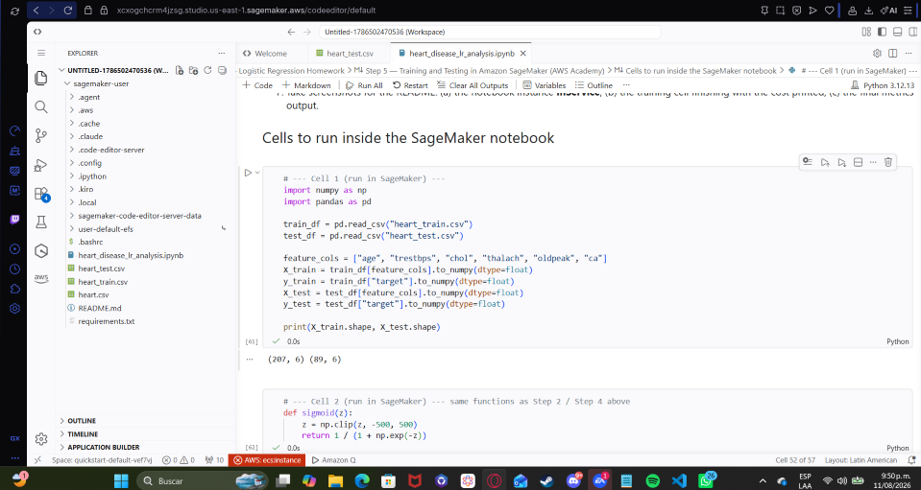
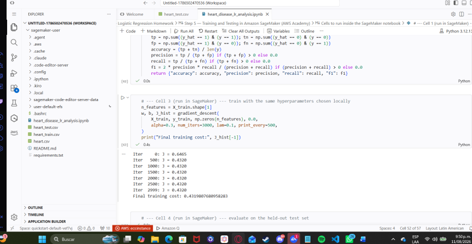
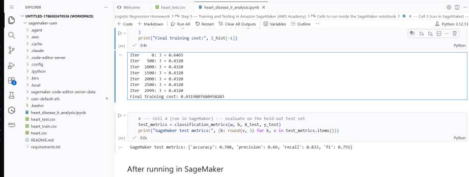

# Heart Disease Risk Prediction — Logistic Regression

## MAKE BY
- Sebastian Albarracin Silva (Ingeneria de Sistemas)

## Exercise Summary

This project implements **logistic regression from scratch** (NumPy/Pandas/
Matplotlib only — no scikit-learn for the core model) to predict the
presence of heart disease from clinical features. The work covers:

- Exploratory data analysis and preprocessing of the Heart Disease dataset.
- A from-scratch logistic regression model: sigmoid function, binary
  cross-entropy cost, gradients, and gradient descent, trained on six
  clinical features.
- Visualization of decision boundaries for pairs of clinically relevant
  features (age–cholesterol, blood pressure–max heart rate, ST
  depression–number of vessels).
- L2-regularized logistic regression, with a sweep over
  `lambda in [0, 0.001, 0.01, 0.1, 1]` and a comparison of regularized vs.
  unregularized decision boundaries.
- Training and testing the same model in **Amazon SageMaker** (AWS
  Academy), using the exact same preprocessed data as the local run, for a
  direct comparison. No SageMaker endpoint or deployment service was created
  or used, per the AWS Academy account limitations for this course.

All implementation, plots, metrics tables and discussion live in
[`heart_disease_lr_analysis.ipynb`](heart_disease_lr_analysis.ipynb).

## Dataset Description

**Source:** [Heart Disease Dataset — Kaggle (neurocipher)](https://www.kaggle.com/datasets/neurocipher/heartdisease)

The dataset is a widely used republication of the UCI Cleveland Heart
Disease data: clinical records with 13 features (age, sex, chest pain type,
resting blood pressure, cholesterol, fasting blood sugar, resting ECG,
maximum heart rate, exercise-induced angina, ST depression, slope of the
peak exercise ST segment, number of major vessels, and thalassemia) plus a
binary target (`1` = disease present, `0` = absent).

The raw CSV (`heart.csv`, 1025 rows) contains many exact duplicate rows —
after removing duplicates, the underlying population is ~300 unique
patients, matching the ~303 patients described in the original UCI dataset.
A small number of rows also contain documented invalid categorical codes
(`ca = 4`, `thal = 0`) which were removed during preprocessing. See Step 1 of
the notebook for the full data-cleaning walkthrough.

Six features were selected for modeling: **age, resting blood pressure
(`trestbps`), cholesterol (`chol`), maximum heart rate (`thalach`), ST
depression (`oldpeak`) and number of major vessels (`ca`)**.

## SageMaker Evidence

The model was trained and evaluated inside **Amazon SageMaker Studio's Code
Editor** (AWS Academy Learner Lab), using the "Step 5" cells from
`heart_disease_lr_analysis.ipynb`, on the same `heart_train.csv` /
`heart_test.csv` produced locally in Step 4. No SageMaker endpoint or
deployment service was created, per the AWS Academy account limitations for
this course.

**Environment:** SageMaker Studio Code Editor (Code-OSS based), Space
`quickstart-default`, `conda base` kernel — Python 3.12.13, region
`us-east-1`.

1. **SageMaker Studio Code Editor running the notebook**, loading
   `heart_train.csv` / `heart_test.csv` (Cell 1 of Step 5)
   
2. **Training execution completed** — cost decreasing over iterations and
   final training cost printed (Cell 3 of Step 5)
   
3. **Test-set metrics** — accuracy, precision, recall and F1 printed after
   evaluating on the held-out test set (Cell 4 of Step 5)
   

**Test-set results (SageMaker):**

| Metric | Value |
|---|---|
| Accuracy | 0.708 |
| Precision | 0.690 |
| Recall | 0.833 |
| F1 | 0.755 |

**Comparison with local execution:** the SageMaker run reproduces the local
results (Step 2, `lambda=0.1`) **exactly** — accuracy 0.708, precision 0.69,
recall 0.833, F1 0.755 in both environments. This is expected: both runs use
the identical preprocessed `heart_train.csv` / `heart_test.csv` exported in
Step 4, the same from-scratch NumPy implementation, and the same
hyperparameters (`alpha=0.3`, `lambda=0.1`, `num_iters=3000`), so there is no
source of randomness or library-version drift left to cause a difference.
This confirms the model's behavior is fully reproducible across local and
cloud environments.

## Repository Contents

- `heart_disease_lr_analysis.ipynb` — end-to-end notebook (EDA, model,
  visualization, regularization, SageMaker write-up, final insights).
- `heart.csv` — raw dataset downloaded from Kaggle.
- `heart_train.csv`, `heart_test.csv` — preprocessed train/test split
  exported by the notebook, used to reproduce results in SageMaker.
- `README.md` — this file.
- `images/` — SageMaker evidence screenshots.

## How to Run Locally

```bash
pip install numpy pandas matplotlib
jupyter notebook heart_disease_lr_analysis.ipynb
```

Run all cells top to bottom. Step 5's code cells are meant to be copied into
a SageMaker notebook, not executed locally (they are included here for
reference and reproducibility).
